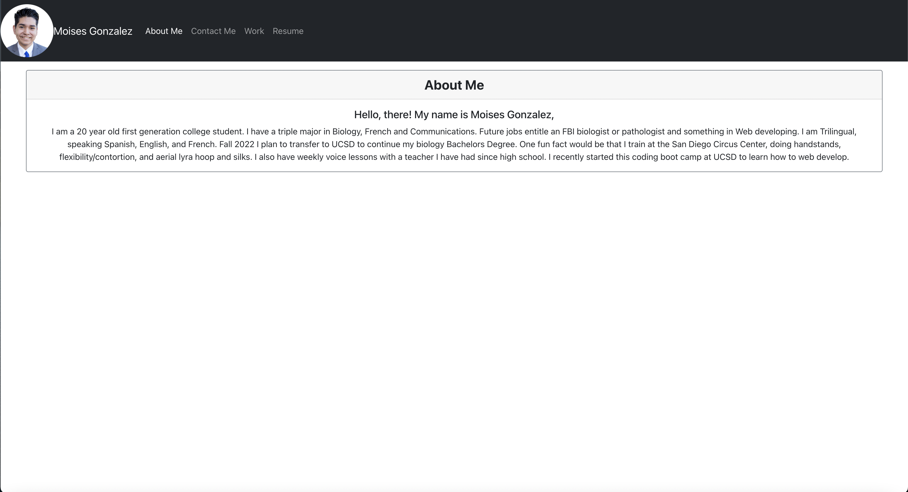
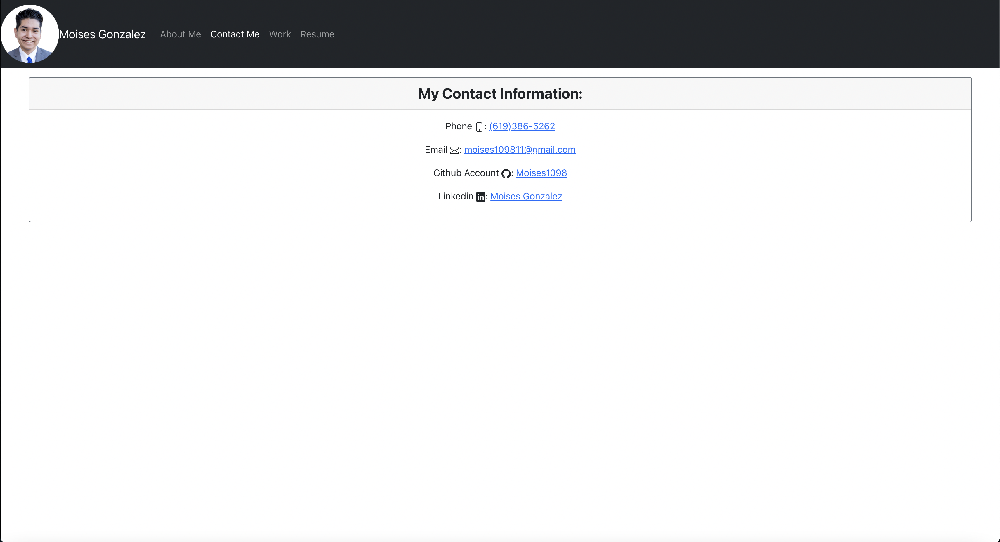
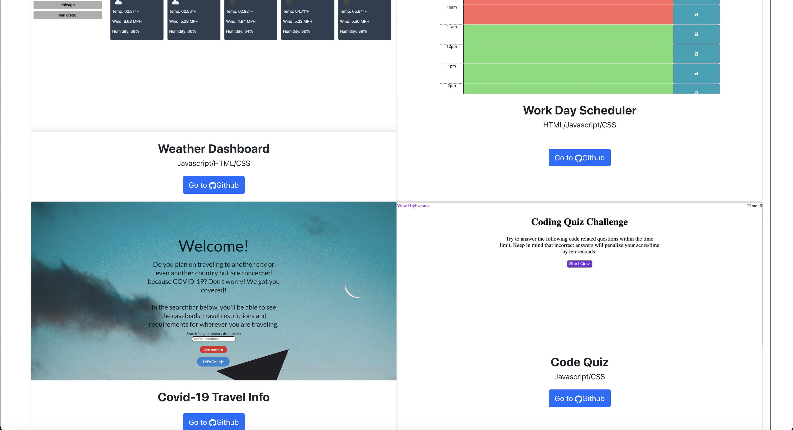
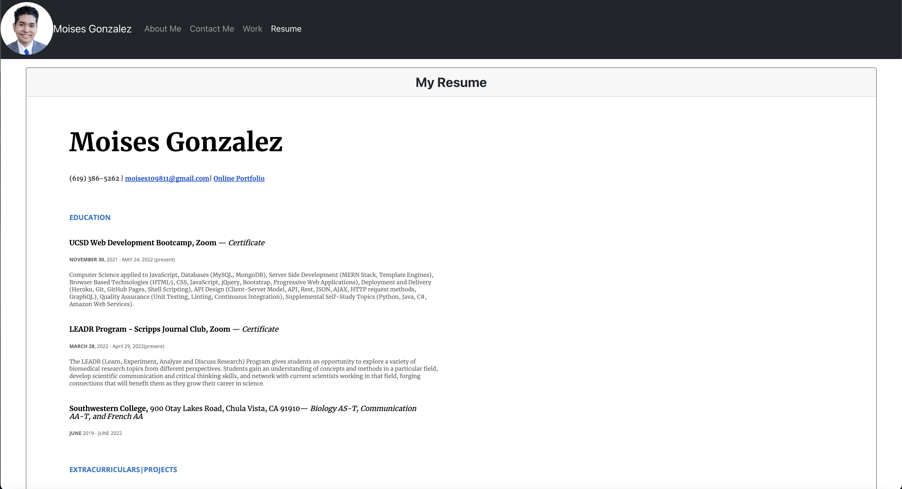
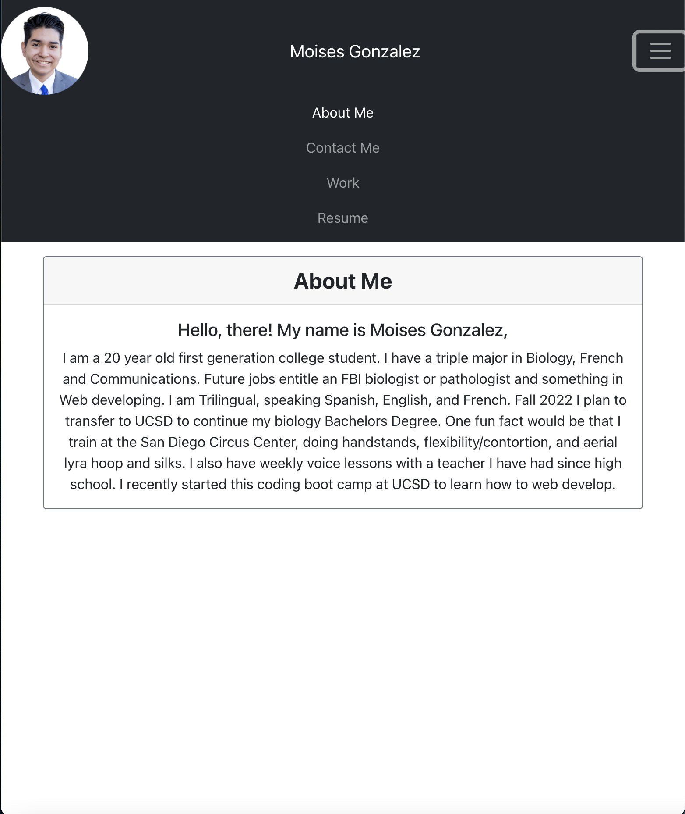

# React Portfolio

## Description

A portfolio of my work that showcases my skills and talents to future employers looking to fill a part-time or full-time position. I have a full stack project on website that my group and I created for a client who owns a business, "Select Nutrition" and a Covid Travel infomormation seacrh website and 2 previous homework assignments such as the coding quiz and the weather dashboard. Works on smaller screens with the hamburger menu.
## Mock-Up

The following pictures shows the web application's appearance and functionality:

#### About Me

#### Contact Me

#### Work (top half)

#### Work (bottom half)

#### Resume

#### Hamburger Menu
